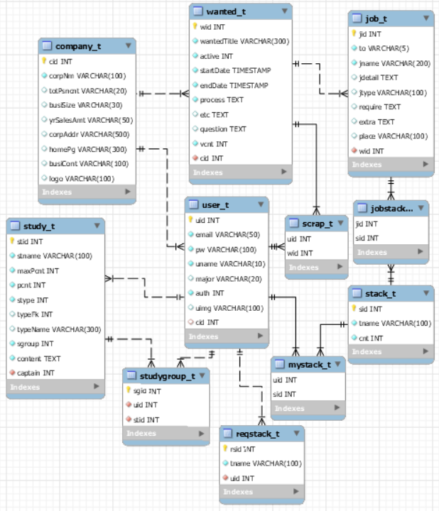

# DB 설계

## 준비사항

1. DBMS
   
   1. MySQL workbench 버전 8.0.19
   
      - [MySQL 워크벤치 download](https://dev.mysql.com/downloads/file/?id=492814)
   
      - [설치 가이드](https://dog-developers.tistory.com/20)

## E - RD

> `mysql`에서 테이블 간 관계



## 스키마 정의

* 기업 정보 테이블 `company_t`

  | 필드명     | 자료형 | 설명              |
  | ---------- | ------ | ----------------- |
  | cid        | string | Primary Key       |
  | corpNm     | string | **(필수)** 회사명 |
  | totPsncnt  | string | 근로자수          |
  | busiSize   | string | 기업규모          |
  | yrSalesAmt | string | 연매출액          |
  | corpAddr   | string | 회사 주소         |
  | homePg     | string | 회사 홈페이지     |
  | busiCont   | string | 주요 사업내용     |
  | logo       | string | 기업 로고         |

* 사용자 정의 테이블 `user_t`

  
   | 필드명 | 자료형  | 설명                            |
   | ------ | ------- | ------------------------------- |
  | uid    | integer | Primary Key                     |
  | email  | string  | **(필수)** id 겸 이메일         |
  | pw     | string  | **(필수)** 패스워드             |
  | uname  | string  | **(필수)** 이름                 |
  | major  | string  | 전공                            |
  | auth   | integer | **(필수, default 1)** 회원 권한 |
  | uimg   | string  | 회원 사진                       |
  | cid    | string  | company_t의 Primary Key(cid)    |
  
* 채용 공고 테이블 `wanted_t`
  

  | 필드명      | 자료형  | 설명                                    |
  | ----------- | ------- | --------------------------------------- |
  | wid         | string  | Primary Key                             |
  | wantedTitle | string  | **(필수)** 공고 제목                    |
  | active      | integer | **(필수, default 0)** 공고 진행 상태    |
  | startDate   | date    | **(필수)** 공고 시작일                  |
  | endDate     | date    | **(필수)** 공고 마감일                  |
  | vcnt        | integer | **(필수)** 공고 조회수                  |
  | cid         | string  | **(필수)** company_t의 Primary Key(cid) |
  | detail      | string  | **(필수)** iframe 주소                  |
  
* 스크랩 정보 테이블 `scrap_t`

  
  | 필드명   | 자료형 | 설명                                   |
  | -------- | ------ | -------------------------------------- |
  | uid, wid | -      | Primary Key                            |
  | uid      | int    | **(필수)** user_t의 Primary Key(uid)   |
  | wid      | string | **(필수)** wanted_t의 Primary Key(wid) |

* 기술 스택 테이블 `stack_t`

  
  | 필드명 | 자료형  | 설명                                     |
  | ------ | ------- | ---------------------------------------- |
  | sid    | integer | Primary Key                              |
  | tname  | string  | 기술 스택 명                             |
  | cnt    | integer | **(필수, default 0)** 사용자가 선택한 수 |

* 내 스택 정보 테이블 `myStack_t`

  | 필드명   | 자료형  | 설명                                  |
  | -------- | ------- | ------------------------------------- |
  | uid, sid |         | Primary Key                           |
  | uid      | integer | **(필수) **user_t의 Primary Key (uid) |
  | sid      | integer | **(필수)** stack_t의 Primary Key(sid) |
  
* 공고 별 기술 스택 정보 테이블 `wantedStack_t`

  | 필드명   | 자료형  | 설명                                   |
  | -------- | ------- | -------------------------------------- |
  | wid, sid |         | Primary Key                            |
  | wid      | string  | **(필수) **wanted_t의 Primary Key(wid) |
  | sid      | integer | **(필수) **stack_t의 Primary Key(sid)  |

* 기술 스택 추가 요청 테이블 `reqStack_t`

  | 필드명 | 자료형  | 설명                                 |
  | ------ | ------- | ------------------------------------ |
  | rsid   | integer | Primary Key                          |
  | tname  | string  | **(필수) ** 기술 스택 명             |
  | uid    | integer | **(필수) **user_t의 Primary Key(uid) |

- 스터디 테이블 `study_t`

  | 필드명   | 자료형            | 설명                                                   |
  | -------- | ----------------- | ------------------------------------------------------ |
  | stid     | Integer           | Primary Key                                            |
  | stname   | string            | **(필수)** 스터디 명                                   |
  | maxPcnt  | Integer           | **(필수)** 최대 인원                                   |
  | pcnt     | Integer           | **(필수, default 1)** 현재 인원                        |
  | stype    | Integer           | **(필수)** 스터디 종류(공고/기업/기술스택/기타)        |
  | typeFk   | Integer(nullable) | 공고/기업/기술스택 선택 시 선택한 id(FK는 아니지만 FK) |
  | typeName | string            | 공고/기업/기술스택/기타 선택한 name                    |
  | sgroup   | Integer           | **(필수)** 스터디 내용(자소서/필기/면접/기타)          |
  | content  | text              | **(필수)** 스터디 상세내용                             |
  | captain  | Integer           | **(필수)** 스터디 장(fk - uid)                         |

- 스터디 그룹 테이블 `studyGroup_t`

  | 필드명 | 자료형  | 설명                              |
  | ------ | ------- | --------------------------------- |
  | sgid   | Integer | Primary Key                       |
  | uid    | Integer | **(필수)** 가입한 회원uid(fk)     |
  | stid   | Integer | **(필수)** 스터디 테이블 stid(fk) |

  

## sql

```sql
drop table if exists mystack_t ;
drop table if exists jobstack_t;
drop table if exists comment_t;
drop table if exists stack_t;
drop table if exists scrap_t;
drop table if exists job_t;
drop table if exists reqstack_t;
drop table if exists user_t;
drop table if exists wanted_t;
drop table if exists company_t;

-- 기업 정보 테이블 정의
create table company_t(
	cid varchar(10) primary key auto_increment,
    corpNm varchar(100) not null,
    totPsncnt varchar(20),
    busiSize varchar(30),
    yrSalesAmt varchar(50),
    corpAddr varchar(500),
    homePg varchar(300),
    busiCont varchar(100),
    logo varchar(100)
);
-- corpNm : 회사명, totPsncnt : 근로자수, busiSize : 기업규모, yrSalesAmt : 연매출액, corpAddr : 회사 주소
-- homePg : 회사 홈페이지, busiCont : 주요 사업내용, logo : 기업 로고

-- 사용자 정보 테이블 정의
create table user_t(
	uid int primary key auto_increment,
    email varchar(50) not null,
    pw varchar(100) not null,
    uname varchar(10) not null,
    major varchar(20),
    auth int not null default 1, -- 1: user, 0: admin
    uimg varchar(100),
    cid varchar(10),
    foreign key(cid) references company_t(cid)
);
-- email : id 겸 이메일, pw : 패스워드 (sha1로 변환하여 저장)
-- uname : 이름, major : 전공, auth : 회원 권한, uimg : 회원 사진

-- 채용 공고 테이블 정의
create table wanted_t(
	wid varchar(10) primary key auto_increment,
    wantedTitle varchar(300) not null,
    active int not null default 0,	-- 0 : 마감, 1 : 진행 중, 2: 오늘 마감, 3: 내일 마감
    startDate timestamp not null,
    endDate timestamp not null,
    process text not null,
    etc text,
    question text,
    vcnt int not null default 0,
    cid varchar(10) not null,
    foreign key(cid) references company_t(cid) on delete cascade
);
-- wantedTitle : 공고 제목, active : 공고 진행 상태, startDate : 공고 시작일, endDate : 공고 마감일
-- process : 채용 과정, etc : 기타 요구사항, question : 문의, vcnt : 공고 조회수

-- 스크랩 정보 테이블 정의
create table scrap_t(
	uid int not null,
    wid varchar(10) not null,
    primary key(uid, wid),
    foreign key(uid) references user_t(uid) on delete cascade on update cascade,
    foreign key(wid) references wanted_t(wid) on delete cascade on update cascade
);
-- 회원이나 공고가 변경되면 댓글도 해당 댓글도 변경되도록 on delete cascade, on update cascade 설정
-- pk : (uid, wid), fk : uid, wid

-- 기술 스택 테이블 정의
create table stack_t(
	sid int primary key auto_increment,
    tname varchar(100) not null,
    cnt int not null default 0
);
-- tname : 기술 스택 명, cnt : 사용자가 선택한 수

-- 내 스택 정보 테이블 정의
create table myStack_t(
	uid int not null,
    sid int not null,
    primary key(uid, sid),
    foreign key(uid) references user_t(uid) on delete cascade on update cascade,
    foreign key(sid) references stack_t(sid) on delete cascade on update cascade
);
-- on delete cascade, on update cascade  / or  No action

-- 직무 정보 테이블 삭제되었음

-- 공고 별 기술 스택 정보 테이블 정의
create table wantedStack_t(
	wid varchar(10) not null,
    sid int not null,
    primary key(wid, sid),
    foreign key(wid) references wanted_t(wid) on delete cascade on update cascade,
    foreign key(sid) references stack_t(sid) on delete cascade on update cascade
);

-- 기술 스택 추가 요청 테이블 정의
create table reqStack_t(
	rsid int primary key auto_increment,
    tname varchar(100) not null,
    uid int not null,
    foreign key(uid) references user_t(uid)
);
-- 사용자가 탈퇴하고 나가도 요청한건 유지할 의미가 있을 순 있기 때문에 얘는 on delete No action

-- 스터디 테이블 정의
create table study_t(
	stid int primary key auto_increment,
    stname varchar(100) not null,
    maxPcnt int not null,
    pcnt int not null default 0,
    stype int not null,
    typeFk int,
    typeName varchar(300),
    sgroup int not null,
    content text not null,
    captain int not null,
    foreign key(captain) references user_t(uid) on update cascade on delete cascade
);

-- 스터디 그룹 테이블 정의
create table studyGroup_t(
	sgid integer primary key auto_increment,
    uid integer not null,
    stid integer not null,
	foreign key(uid) references user_t(uid) on update cascade on delete cascade,
    foreign key(stid) references study_t(stid) on update cascade on delete cascade
);

commit;

```

